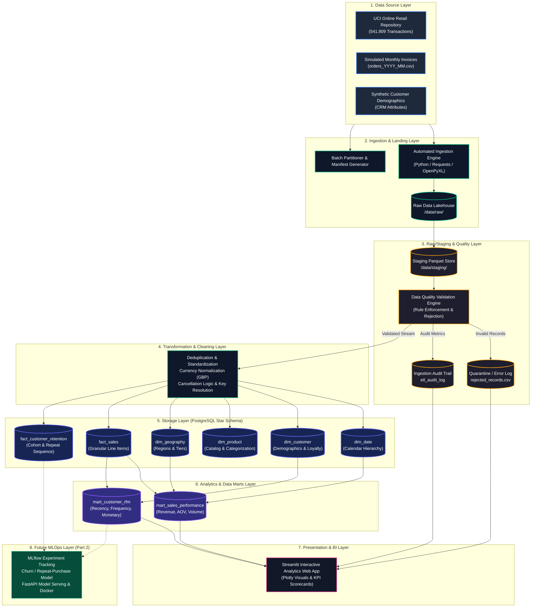
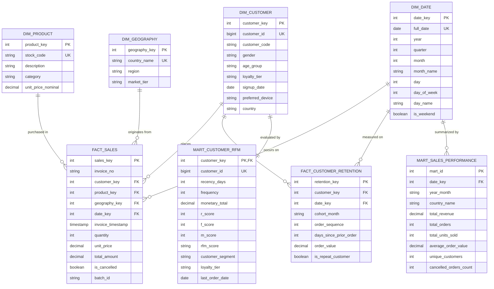
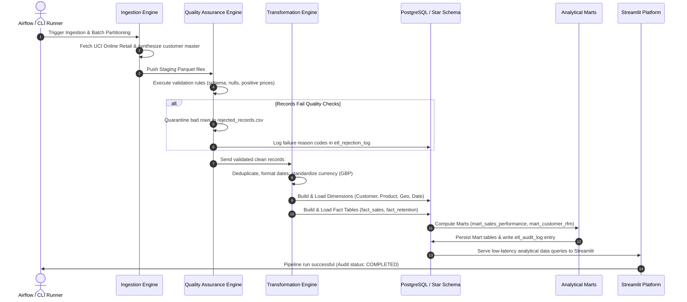

# System Architecture and Data Pipeline Flow

## 1. End-to-End System Architecture

The analytics platform follows a decoupled, multi-tier Lakehouse/Warehouse architecture designed for enterprise reliability, auditability, and analytical performance.

---

## 2. Dimensional Data Warehouse (Star Schema ER Diagram)

The dimensional data warehouse employs a classic **Star Schema** pattern optimized for analytical queries (OLAP), slice-and-dice drill-downs, and business intelligence dashboards.

---

## 3. Orchestrated Pipeline Execution Flow (Airflow DAG)

